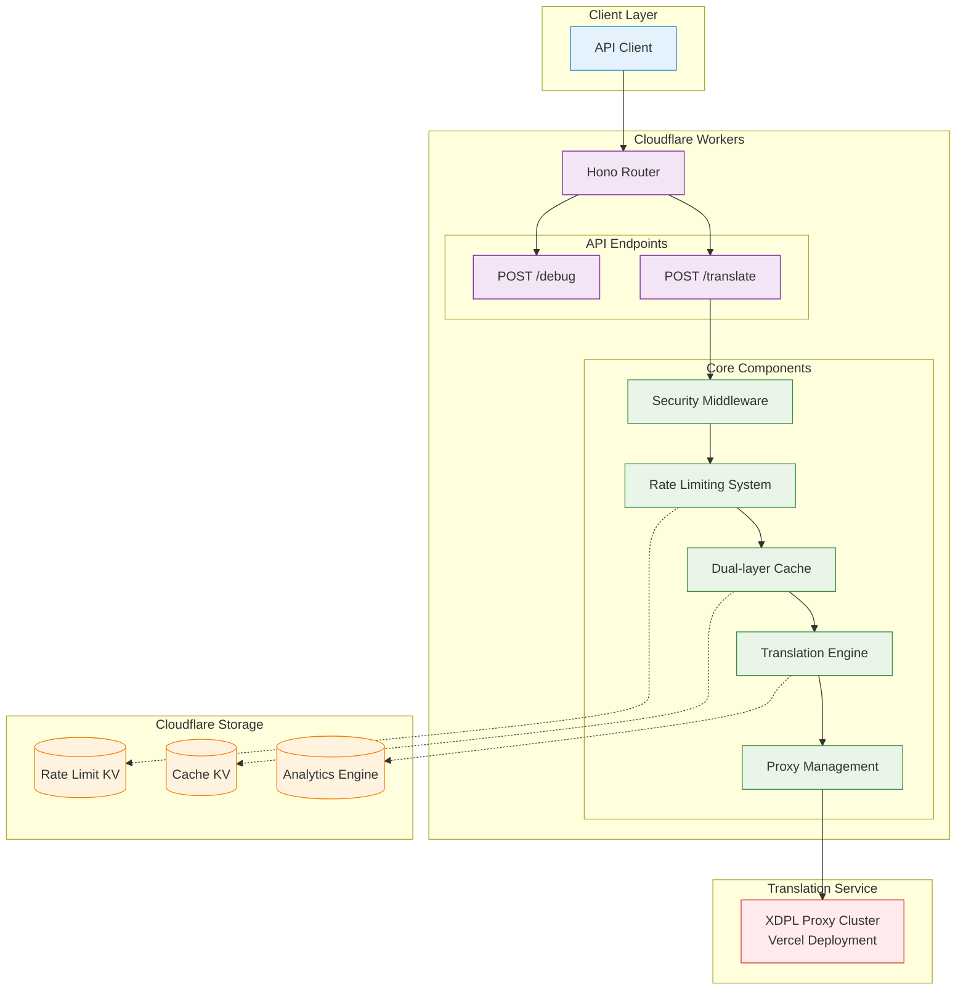

# DeepLX

***[汉语](README.zh.md)***

[](#-license)
[](#-online-service)
[](#-self-deployment)

Currently, the best serverless implementation of [DeepLX](https://github.com/OwO-Network/DeepLX), optimized for Cloudflare Workers. Through intelligent proxy endpoint rotation, advanced rate limiting algorithms, and circuit breaker mechanisms, it almost completely avoids HTTP 429 errors, providing higher request rate limits and lower network round-trip times than the DeepL API.

## 🆓 **Completely FREE Alternative to DeepL API**

**Unlike the paid DeepL API, DeepLX is completely free to use** - no API keys, no subscription fees, no usage limits. Simply deploy once and enjoy unlimited translation requests without any cost concerns.

## ✨ Features & Performance Advantages

### 🚀 Performance Advantages

DeepLX has significant improvements in performance and stability compared to the DeepL API. Here are key metric comparisons based on specific network environments:

| Metric | DeepL API | DeepLX (Pre-deployed Instance) |
|--------|-----------|-------------------------------|
| Rate Limit | 50 requests/sec | 80 requests/sec (8 req/sec × 10 proxy endpoints) |
| Average Network RTT | ~450ms | ~180ms (edge network acceleration) |
| HTTP 429 Error Rate | 10-30% | <1% |
| Concurrent Support | Single endpoint limit | Multi-endpoint load balancing |
| Geographic Distribution | Limited | 330+ global edge nodes |

#### Core Performance Features

- **Higher Rate Limits**: Intelligent load balancing supports higher concurrent requests than DeepL API
- **Lower Latency**: Global edge network deployment based on Cloudflare Workers
- **Zero Cold Start**: Serverless architecture with instant response
- **Intelligent Caching**: Dual-layer caching system (memory + KV storage) reduces duplicate requests

#### Technical Advantages

- **Intelligent Load Balancing**: Multiple proxy endpoints automatically distribute requests
- **Dynamic Rate Limiting Algorithm**: Automatically adjusts rate limits based on proxy count
- **Dual-layer Caching System**: Memory cache + KV storage reduces duplicate requests
- **Circuit Breaker Mechanism**: Automatic failover for failed endpoints ensures service continuity
- **Edge Computing**: Global deployment on Cloudflare Workers reduces latency

### 🛡️ Stability Guarantees

- **Avoid HTTP 429 Errors**: Almost completely avoids rate limiting through proxy endpoint rotation and token bucket algorithm
- **Circuit Breaker Mechanism**: Automatically detects failed endpoints and performs failover
- **Exponential Backoff Retry**: Intelligent retry mechanism improves success rate

### 🔒 Security Features

- **Input Validation**: Comprehensive parameter validation and text sanitization
- **Rate Limiting**: Multi-dimensional rate limiting based on client IP and proxy endpoints
- **CORS Support**: Flexible cross-origin resource sharing configuration
- **Security Headers**: Automatically adds security-related HTTP headers
- **Error Sanitization**: Sensitive information is never exposed

## 🏗️ Architecture Overview



## 🌐 Online Service

**Pre-deployed Instance**: `https://dplx.xi-xu.me`

## 📦 Quick Start

### cURL Example

```bash
curl -X POST https://dplx.xi-xu.me/translate \
  -H "Content-Type: application/json" \
  -d '{
    "text": "Hello, world!",
    "source_lang": "EN",
    "target_lang": "ZH"
  }'
```

### JavaScript Example

```javascript
async function translate(text, sourceLang = 'auto', targetLang = 'zh') {
  const response = await fetch('https://dplx.xi-xu.me/translate', {
    method: 'POST',
    headers: {
      'Content-Type': 'application/json',
    },
    body: JSON.stringify({
      text: text,
      source_lang: sourceLang,
      target_lang: targetLang
    })
  });
  
  const result = await response.json();
  return result.data;
}

// Usage example
translate('Hello, world!', 'en', 'zh')
  .then(result => console.log(result))
  .catch(error => console.error(error));
```

### Python Example

```python
import requests
import json

def translate(text, source_lang='auto', target_lang='zh'):
    url = 'https://dplx.xi-xu.me/translate'
    data = {
        'text': text,
        'source_lang': source_lang,
        'target_lang': target_lang
    }
    
    response = requests.post(url, json=data)
    result = response.json()
    
    if result['code'] == 200:
        return result['data']
    else:
        raise Exception(f"Translation failed: {result.get('message', 'Unknown error')}")

# Usage example
try:
    result = translate('Hello, world!', 'en', 'zh')
    print(result)
except Exception as e:
    print(f"Error: {e}")
```

## API Client Integration

Configure API clients to use the pre-deployed instance:

### [DeepLX App](https://github.com/xixu-me/DeepLX-App) (Open-source web app)

A modern, free web-based translation app powered by the DeepLX API. Features include:

- Multi-language auto-detection support
- Real-time translation as you type
- Translation history and language switching
- Responsive design for all devices
- RTL language support

**Live Demo**: [https://deeplx.xi-xu.me](https://deeplx.xi-xu.me)

### [Pot](https://github.com/pot-app/pot-desktop/blob/master/README_EN.md) (Open-source cross-platform Windows, macOS, and Linux app)

1. [Download and install Pot for your platform](https://github.com/pot-app/pot-desktop/releases/latest)
2. Open Pot settings and navigate to Service Settings
3. Configure the DeepL service type as DeepLX and set the custom URL to `https://dplx.xi-xu.me/translate`

### [Zotero](https://www.zotero.org/) (Open-source reference management app)

1. [Download and install Zotero for your platform](https://www.zotero.org/download/)
2. Download and install the [Translate for Zotero](https://github.com/windingwind/zotero-pdf-translate) plugin
3. Open Zotero settings and navigate to the Services section under Translation
4. Configure the translation service as DeepLX (API) and set the endpoint to `https://dplx.xi-xu.me/translate` after clicking the config button

### [PDFMathTranslate (pdf2zh)](https://github.com/Byaidu/PDFMathTranslate) (Open-source PDF document translation tool)

Refer to [Advanced Options](https://github.com/Byaidu/PDFMathTranslate?tab=readme-ov-file#advanced-options) and [Translate with different services](https://github.com/Byaidu/PDFMathTranslate/blob/main/docs/ADVANCED.md#translate-with-different-services).

### [Immersive Translate](https://immersivetranslate.com/) (Closed-source browser extension)

1. [Install Immersive Translate](https://immersivetranslate.com/download/)
2. Go to developer settings and enable beta testing features
3. Go to translation services and add a custom translation service DeepLX, configure the API URL to `https://dplx.xi-xu.me/translate`
4. Configure the maximum requests per second and maximum text length per request to appropriate values (e.g., `80` and `5000`) to ensure stability and performance

### [Bob](https://bobtranslate.com/) (Closed-source macOS app)

1. [Download and install Bob from the Mac App Store](https://apps.apple.com/app/id1630034110)
2. Download and install the [bob-plugin-deeplx](https://github.com/missuo/bob-plugin-deeplx) plugin
3. Configure the plugin to use `https://dplx.xi-xu.me/translate`

## 🚀 Self-deployment

[](https://deploy.workers.cloudflare.com/?url=https://github.com/xixu-me/DeepLX)

### Prerequisites

- Node.js 18+
- Cloudflare Workers account
- Wrangler CLI

### 1. Clone Repository

```bash
git clone https://github.com/xixu-me/DeepLX.git
cd DeepLX
```

### 2. Install Dependencies

```bash
npm install
```

### 3. Configure Environment

Edit the `wrangler.jsonc` file and update the following configuration:

```jsonc
{
  "account_id": "YOUR_CLOUDFLARE_ACCOUNT_ID",
  "name": "YOUR_WORKER_NAME",
  "vars": {
    "DEBUG_MODE": "false",
    "PROXY_URLS": "your_proxy_endpoint_list,comma_separated"
  }
}
```

### 4. Create KV Namespaces

```bash
# Create cache KV namespace
npx wrangler kv namespace create "CACHE_KV"

# Create rate limit KV namespace  
npx wrangler kv namespace create "RATE_LIMIT_KV"
```

Update the returned namespace IDs to the `kv_namespaces` configuration in `wrangler.jsonc`.

### 5. Deploy to Cloudflare Workers

```bash
# Development environment
npx wrangler dev

# Production deployment
npx wrangler deploy
```

## 🔧 Proxy Endpoint Deployment

For optimal performance and stability, it's recommended to deploy as many [XDPL](https://github.com/xixu-me/XDPL) proxy endpoints as possible:

### Quick Deploy XDPL

[](https://vercel.com/new/clone?repository-url=https://github.com/xixu-me/XDPL)

### Configure Proxy Endpoints

1. Deploy multiple XDPL instances
2. Add the deployed URLs to DeepLX's `PROXY_URLS` environment variable:

```jsonc
{
  "vars": {
    "PROXY_URLS": "https://your-xdpl-1.vercel.app/jsonrpc,https://your-xdpl-2.vercel.app/jsonrpc,https://your-xdpl-3.vercel.app/jsonrpc,https://your-xdpl-n.vercel.app/jsonrpc"
  }
}
```

## 📖 API Reference

### `/translate`

**Request Method**: `POST`

**Request Headers**: `Content-Type: application/json`

**Request Parameters**:

| Parameter | Type | Description | Required |
| - | - | - | - |
| `text`        | string | Text to translate | Yes |
| `source_lang` | string | Source language code | No, default `AUTO` |
| `target_lang` | string | Target language code | No, default `EN` |

**Response**:

```json
{
  "code": 200,
  "data": "Translation result",
  "id": "Random identifier",
  "source_lang": "Detected source language code",
  "target_lang": "Target language code"
}
```

**Supported Language Codes**:

- `AUTO` - Auto-detect (source language only)
- `AR` - Arabic
- `BG` - Bulgarian
- `CS` - Czech
- `DA` - Danish
- `DE` - German
- `EL` - Greek
- `EN` - English
- `ES` - Spanish
- `ET` - Estonian
- `FI` - Finnish
- `FR` - French
- `HE` - Hebrew
- `HU` - Hungarian
- `ID` - Indonesian
- `IT` - Italian
- `JA` - Japanese
- `KO` - Korean
- `LT` - Lithuanian
- `LV` - Latvian
- `NB` - Norwegian Bokmål
- `NL` - Dutch
- `PL` - Polish
- `PT` - Portuguese
- `RO` - Romanian
- `RU` - Russian
- `SK` - Slovak
- `SL` - Slovenian
- `SV` - Swedish
- `TH` - Thai
- `TR` - Turkish
- `UK` - Ukrainian
- `VI` - Vietnamese
- `ZH` - Chinese

For the latest language support list, please refer to [Languages supported - DeepL Documentation](https://developers.deepl.com/docs/getting-started/supported-languages#translation-source-languages).

### `/debug` (Only available when `DEBUG_MODE=true`)

**Request Method**: `POST`

Used to verify request format and troubleshoot issues.

### Error Codes

| Code | Description |
|------|-------------|
| 200 | Translation successful |
| 400 | Request parameter error |
| 429 | Request rate too high |
| 500 | Internal server error |
| 503 | Service temporarily unavailable |

## ⚙️ Configuration

### Environment Variables

| Variable | Description | Default |
|----------|-------------|---------|
| `DEBUG_MODE` | Debug mode switch | `false` |
| `PROXY_URLS` | Proxy endpoint list, comma-separated | None |

### Performance Configuration

Can be adjusted in `src/lib/config.ts`:

```typescript
// Request timeout
export const REQUEST_TIMEOUT = 10000; // 10 seconds

// Retry configuration
export const DEFAULT_RETRY_CONFIG = {
  maxRetries: 3,              // Maximum retry attempts
  initialDelay: 1000,         // Initial delay
  backoffFactor: 2,          // Backoff factor
};

// Rate limit configuration
export const RATE_LIMIT_CONFIG = {
  PROXY_TOKENS_PER_SECOND: 8,    // Tokens per proxy per second
  PROXY_MAX_TOKENS: 16,          // Maximum tokens per proxy
  BASE_TOKENS_PER_MINUTE: 480,   // Base tokens per minute
};

// Payload limits
export const PAYLOAD_LIMITS = {
  MAX_TEXT_LENGTH: 5000,         // Maximum text length
  MAX_REQUEST_SIZE: 32768,       // Maximum request size
};
```

## 🧪 Testing

```bash
# Run all tests
npm test

# Run unit tests
npm run test:unit

# Run integration tests
npm run test:integration

# Run performance tests
npm run test:performance

# Generate coverage report
npm run test:coverage
```

## 🔧 Troubleshooting

### Common Issues

#### 1. HTTP 429 errors still occur frequently

- Check if proxy endpoint configuration is correct
- Increase the number of proxy endpoints
- Adjust rate limiting configuration

#### 2. Translation results are inaccurate

- Confirm source language detection is correct
- Check if text encoding is correct
- Verify language code format

#### 3. Deployment fails

- Check Cloudflare account configuration
- Verify KV namespaces are created
- Confirm wrangler.jsonc configuration is correct

### Debug Mode

Enable debug mode for detailed information:

```jsonc
{
  "vars": {
    "DEBUG_MODE": "true"
  }
}
```

Then use the debug endpoint:

```bash
curl -X POST https://your-domain.workers.dev/debug \
  -H "Content-Type: application/json" \
  -d '{"text": "test", "source_lang": "EN", "target_lang": "ZH"}'
```

## 🙏 Acknowledgments

- [OwO-Network/DeepLX](https://github.com/OwO-Network/DeepLX) - Original implementation based on Go programming language
- [Cloudflare Workers](https://workers.cloudflare.com/) - Hosting platform
- [Hono](https://hono.dev/) - Fast web framework
- [XDPL](https://github.com/xixu-me/XDPL) - Proxy endpoint solution

## 🤝 Contributing

We welcome all forms of contributions! Please check the [Contributing Guide](CONTRIBUTING.md) to learn how to participate in repository development.

1. **Report Issues**: Use [issue templates](https://github.com/xixu-me/DeepLX/issues/new/choose) to report bugs or request features
2. **Submit Code**: Fork the repository, create feature branches, submit pull requests
3. **Improve Documentation**: Fix errors, add examples, improve descriptions
4. **Test Feedback**: Test in different environments and provide feedback

## 🌟 Star History

<a href="https://www.star-history.com/#xixu-me/DeepLX&Date">
 <picture>
   <source media="(prefers-color-scheme: dark)" srcset="https://api.star-history.com/svg?repos=xixu-me/DeepLX&type=Date&theme=dark" />
   <source media="(prefers-color-scheme: light)" srcset="https://api.star-history.com/svg?repos=xixu-me/DeepLX&type=Date" />
   
 </picture>
</a>

## 📞 Contact

- **Author**: [Xi Xu](https://xi-xu.me)
- **Email**: [Contact Email](mailto:i@xi-xu.me)
- **Sponsor**: [Sponsor Link](https://xi-xu.me/#sponsorships)

## ⚠️ Disclaimer

This repository is for learning and research purposes only. When using this repository, please comply with the following terms:

### Terms of Use

1. **Compliant Use**: Users are responsible for ensuring that use of this repository complies with local laws and regulations and relevant terms of service
2. **Commercial Use**: Before commercial use, please confirm compliance with DeepL's terms of service and usage policies
3. **Service Stability**: This repository relies on third-party services and does not guarantee 100% service availability
4. **Data Privacy**: Translation content is processed through third-party services, please do not translate sensitive or confidential information

### Limitation of Liability

- The author is not responsible for any direct or indirect losses caused by using this repository
- Users should bear the risks of use, including but not limited to service interruption, data loss, etc.
- This repository provides no warranty of any kind, including merchantability, fitness for a particular purpose, etc.

### Terms of Service

By using this repository, you agree to:

- Not use this repository for any illegal or harmful purposes
- Not abuse the service or conduct malicious attacks
- Follow reasonable use principles and avoid excessive load on the service

**Please use this repository only after fully understanding and agreeing to the above terms.**

## 📝 License

This repository is licensed under the MIT License - see the [LICENSE](LICENSE) file for details.

---

<div align="center">

**If this repository is helpful to you, please consider giving it a ⭐ star!**

Made with ❤️ by [Xi Xu](https://xi-xu.me)

</div>
